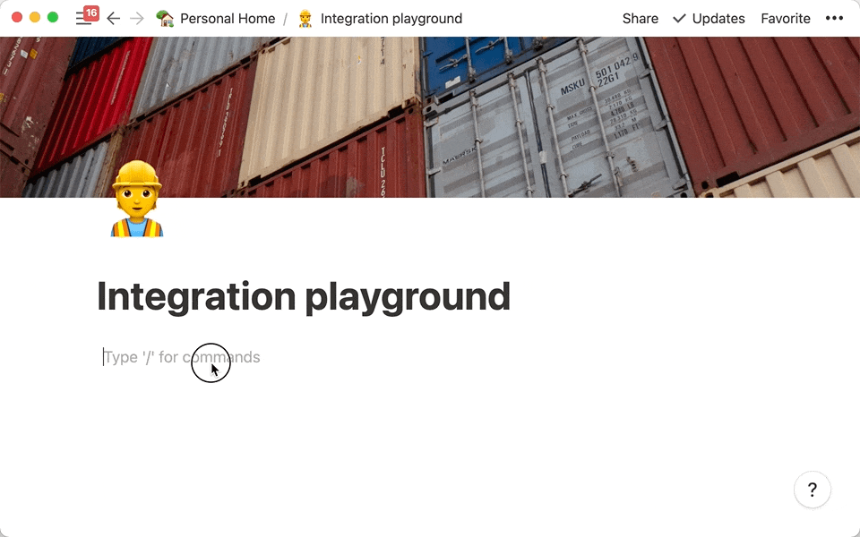

# JIRA2Notion

A small Node app to create or update Notion pages from Jira issues.


* [Features](#features)
* [Prerequisitel](#prerequisite)
* [Installation](#installation)
* [License](#license)

## 🚀 Features
- ✅ Import issues from JIRA into Notion regularly
    - Regularly time: Every hour from 09:00 (UTC+8) through 21:00 (UTC+8) on every day-of-week from Monday through Friday.
    - Condition: Has been updated in the past 12 hours and is the current user’s issue.
- ✅ Check whether the issue already exists in Notion to avoid repeated import.
- ✅ Check whether the issue status of the existing Notion is the same as the status in JIRA, and update it.
- ✅ Use [Firestore](https://firebase.google.com/docs/firestore) to save all sensitive data.

## 📝 Prerequisite

If you did not serve your own server, you do not need to create Firestore database.

**Just follow step 1 to 23 generate your JIRA and Notion token and setup Notion page.**

And give your token to somebody who serves the server and Firestore database.


### 1. Generate JIRA token

We need JIRA token to access your JIRA data without user ID and password.

- 1. Login and go to [Atlassian manage profile](https://id.atlassian.com/manage-profile/security/api-tokens). Click create API token.
    
     
- 2. Copy your JIRA token.
    

### 2. Setup the Notion page

The page which you want to import the JIRA issues need to have specified columns.

In the real version, we have defined the following fields. 

We expect to add more fields in the future and manage these fields through config.

- Done
    - type: `Checkbox`
- Status
    - type: `Single select`
- Name
    - type: `Title`
- JIRA Key
    - type: `Text`
- JIRA Link
    - type: `URL`
    
It will look like


### 3. Generate Notion token and setup page

We need Notion token to access your Notion database.

- 1. Login and go to [Notion integrations page](https://www.notion.so/my-integrations). Click create new integration.
     

- 2. Copy your Notion token.
     
     
- 3. Share a database with your integration.
     

- 4. Copy the database ID.
    ```shell
    https://www.notion.so/myworkspace/a8aec43384f447ed84390e8e42c2e089?v=...
                                      |--------- Database ID --------|
    ```

### 4. Connection file for Firestore (Optional)

In order to store sensitive data, including information such as certificates and mailboxes, and to manage configuration parameters through the Firestore database in the future.

We must first create a Firestore database and link it.

- 1. Go to [Firestore console](https://console.firebase.google.com/) and create new project
     

- 2. Generate a new private key and save the JSON file.
     

- 3. Please add it into `./server/configs` folder, and rename it to `serviceAccountKey.json`. **Remember do not commit yours `serviceAccountKey.json` to the cloud.**
     
     
### 5. Configuration schema in Firestore (Optional)

Go to your Firebase console, and setup Database with following schema.

- Path
    ```shell
    users (collection)
    --> <AUTO_GENERATE_UID> (document)
    ----> (fields)
    ```

- Fields
    ```json
    {
        "jiraEmail": "<YOUR_JIRA_ACCOUNT_EMAIL>",
        "jiraToken": "<YOUR_JIRA_ACCOUNT_TOKEN>",
        "notionDatabaseId": "<YOUR_NOTION_DATABASE_ID>",
        "notionToken": "<YOUR_NOTION_TOKEN>"
    }
    ```
  
When everything is done, your Firestore will look like this:


**If you need handle multiple account, just add data in (document) below `users` (collection)**

## 👷 Installation

### Environment

- Node: v14.16.1

### Auto run

After you finish the above configurations, then do

```shell
sh ./scripts/runScript.sh
```

It will build the latest version of the code and name the container to `jira2notion` and auto run it.

### Manual run in local (Optioneal)

#### Run without docker in once time

```shell
cd server
yarn install
node ./server/index.js
```

#### Build docker
```shell
docker build -f scripts/Dockerfile -t jira2notion:latest .
```

#### Run docker
```shell
docker run --name jira2notion -dit jira2notion
```

## 🔑 License

Released under the MIT License.